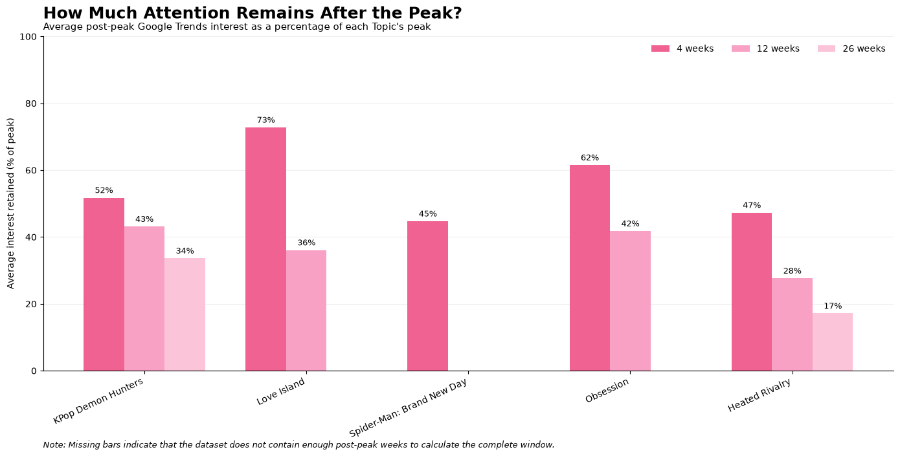

# Google Trends Weekly Pipeline

This project explores how online search interest changes over time for popular movies and television shows. Using a single Google Trends comparison, the pipeline validates a manually downloaded weekly export, converts it to tidy time-series data, and calculates descriptive post-peak features for five entertainment Topics.

The final cohort includes:

- KPop Demon Hunters — 2025 film
- Love Island — reality show
- Spider-Man: Brand New Day — 2026 film
- Obsession — 2025 film
- Heated Rivalry — television series

The pipeline focuses on reproducible data validation and transformation rather than forecasting or estimating absolute search counts or audience size.

## Findings

The five entertainment Topics showed noticeably different attention lifecycles over the observation period. Some experienced sharp, short-lived spikes, while others maintained a larger share of their peak search interest over the following weeks.


The size of a Topic's peak did not necessarily correspond to more persistent attention. To compare persistence across Topics with different peak values, I calculated average post-peak interest as a percentage of each Topic's own peak.



Love Island retained the largest share of its peak attention over the following four weeks at approximately **73%**, followed by Obsession at **62%**, KPop Demon Hunters at **52%**, Heated Rivalry at **47%**, and Spider-Man: Brand New Day at **45%**.

Among Topics with enough subsequent data to measure longer windows, attention continued to decline. KPop Demon Hunters retained approximately **43%** of its peak over the following 12 weeks and **34%** over 26 weeks, while Heated Rivalry retained approximately **28%** and **17%**, respectively.

These results are descriptive of this five-Topic cohort rather than evidence of a universal internet "attention span." Missing longer-term values indicate that a Topic peaked too late in the observation period to calculate a complete post-peak window; they are not treated as zero.

## Acquire The Export

The final dataset uses five Google Trends Topics:

- KPop Demon Hunters — 2025 film
- Love Island — reality show
- Spider-Man: Brand New Day — 2026 film
- Obsession — 2025 film
- Heated Rivalry — television series

In Google Trends Explore, use:

- Geography: United States
- Search property: Web Search
- Time range: 2025-10-01 through 2026-10-01
- Frequency: weekly
- Entity type: Topics only

All five Topics must be included together in one comparison and exported from the **Interest over time** chart. This preserves Google's shared normalization across the five series. Do not combine independently exported series.

## Student-Approved Deviations from Architect Plan

The approved Architect plan in `docs/plan.md` remains unchanged as the historical project plan. After real-data collection, the original three-year request produced monthly rather than weekly observations, so I selected the one-year interval from 2025-10-01 through 2026-10-01 to preserve weekly granularity. I also narrowed the original broad cultural cohort to entertainment Topics after shared normalization compressed lower-volume Topics toward zero.

The final single request used these exact Google Trends Topic labels and descriptions:

- KPop Demon Hunters — 2025 film
- Love Island — Reality show
- Spider-Man: Brand New Day — 2026 film
- Obsession — 2025 film
- Heated Rivalry — Television series

Download the CSV unchanged as `data/raw/trends.csv`. Copy `data/raw/manifest.example.yaml` to `data/raw/manifest.yaml`, then fill in the request ID, retrieval timestamp, Explore URL, exact Topic labels/descriptions, exact CSV headers, and SHA-256.

On macOS, calculate the checksum with:

```sh
shasum -a 256 data/raw/trends.csv
```

## Install And Run

Python 3.11 or newer is required. From the repository root:

```sh
python3 -m venv .venv
source .venv/bin/activate
python -m pip install -e '.[dev]'
```

Validate without writing processed outputs:

```sh
trends-pipeline validate \
  --input data/raw/trends.csv \
  --manifest data/raw/manifest.yaml
```

Run the full pipeline:

```sh
trends-pipeline run \
  --input data/raw/trends.csv \
  --manifest data/raw/manifest.yaml \
  --output-dir data/processed \
  --report reports/validation.json
```

`run` writes `data/processed/time_series.csv`, `data/processed/features.csv`, and the validation report. The raw export remains untouched. The CLI exits nonzero and reports an error for checksum mismatches, invalid mappings or metadata, malformed dates/scores, conflicting duplicates, or unexpected weekly cadence. Identical duplicate rows are collapsed with a warning; gaps and missing scores are reported and never imputed.

## Output Definitions

The time-series CSV has one row per Topic/week and records request/series identifiers, Topic label and description, entity type, ISO date, interest index, geography, weekly frequency, and partial-week status. Blank source cells remain missing and zero remains zero.

The feature CSV contains coverage dates, nonblank observation count, global maximum, earliest date at that maximum, peak tie count, whole-window median, and means for the 4, 12, and 26 exact weekly observations after the peak. Each horizon excludes the peak and is complete only when every following week is present, nonblank, and not a partial edge week. Missing/incomplete horizons are blank with a corresponding `post_peak_N_complete` false flag. All-zero series have no defined peak date or post-peak windows.

These post-peak means are descriptive fixed windows, not time-to-peak, baseline, half-life, decay rate, or a single-cycle curve. This matters especially for recurring or multi-event entertainment Topics such as Love Island.

## Docker

Build the image:

```sh
docker build -t trends-pipeline .
```

Run it with mounted input and output directories:

```sh
mkdir -p data/processed reports
docker run --rm \
  -v "$PWD/data/raw:/input:ro" \
  -v "$PWD/data/processed:/output" \
  -v "$PWD/reports:/reports" \
  trends-pipeline run \
  --input /input/trends.csv \
  --manifest /input/manifest.yaml \
  --output-dir /output \
  --report /reports/validation.json
```

The automated Docker smoke check uses only the clearly labeled synthetic fixture:

```sh
bash scripts/docker-smoke-test.sh
```

## Tests And Interpretation

Run offline automated tests with `pytest`. They use synthetic data and do not contact Google. After acquiring real data, manually compare the export's dates, Topic labels, row counts, selected values or peaks, gaps, blanks, zeros, and partial weeks against the Explore chart. Also confirm that the CSV and manifest describe the same single request. This manual comparison is intentionally left to the project owner.

### Manual Smoke Test

I manually tested the pipeline using the real five-Topic Google Trends export. The first validation attempt revealed that the real weekly CSV used `Time` as its date-column header, while the original parser expected `Week`. I preserved the raw CSV unchanged and returned the issue to the Builder. The parser was updated to support the real export format and a regression test was added.

After the Builder correction, all 23 automated tests passed. I reran both the validation and full pipeline commands successfully on the real export. The pipeline identified 53 weekly observations, zero gap weeks, zero missing values, two partial edge weeks, and zero duplicate rows. After the later Tester phase added date-boundary validation cases, the final automated suite contained 26 passing tests.

I also manually inspected the generated time-series and feature outputs against the Google Trends visualization. Peak dates and values were consistent with the source data, and post-peak windows that extended beyond the available observation period were correctly marked incomplete rather than calculated from partial data.

Google Trends values are sampled, normalized relative search-interest indices, not search counts, audience size, or total public attention. Zero does not mean there were no searches, and low-volume values can be noisy. Topic grouping is not fully transparent and may include or omit variants; this five-case cohort is illustrative, not representative of internet culture. Attribute the source to Google Trends. Transformations are reproducible against the preserved export and manifest, but a future Google export may differ.

## AI-Assisted Development Workflow

This project was completed using the new-project option and an Architect → Builder → Tester workflow. I used each AI role for a different stage of development while independently reviewing methodological and technical decisions.

### Architect

The Architect helped define the initial pipeline requirements, project structure, validation strategy, feature definitions, testing approach, and containerization plan. The approved plan is preserved in `docs/plan.md`.

I did not follow every initial recommendation unchanged. The Architect originally proposed a three-year comparison of broader cultural phenomena. During manual Google Trends data collection, I found that the three-year request produced monthly rather than weekly observations. I changed the request to a one-year interval to preserve weekly resolution. I also narrowed the cohort to movies and television after experimenting with broader Topics and finding that Google's shared normalization compressed lower-volume series toward zero.

I also chose to analyze Topic trajectories directly rather than add manually curated event dates, keeping the project focused on observed attention patterns.

### Builder

The Builder implemented the pipeline from the approved plan, including manifest-backed validation, tidy time-series transformation, post-peak features, automated tests, CLI commands, and Docker support.

I manually tested the implementation using the real Google Trends export rather than relying only on its synthetic fixtures. This exposed an incompatibility: the real weekly export used `Time` as its date header while the initial parser expected `Week`. I preserved the raw export and returned the issue to the Builder. The Builder updated the parser and added a regression test before I reran the workflow successfully.

### Tester

The Tester independently compared the implementation with the Architect plan, ran the automated and Docker workflows, reproduced the real-data outputs, and tested additional edge behavior.

I accepted its recommendation to strengthen date-boundary validation after it demonstrated that an observation well outside the manifest request interval could be accepted. The resulting correction allows legitimate weekly buckets that overlap the request boundaries while rejecting buckets that do not overlap the requested interval.

I modified the Tester's recommendation to update `docs/plan.md`. Rather than retroactively changing the approved Architect artifact, I preserved the original plan and documented my later methodological decisions in this README.

I also accepted the Tester's recommendation to improve Topic provenance documentation by recording the exact final Google Trends Topic labels and descriptions.

After the approved Tester corrections, all 26 automated tests passed. Real-data validation and processing succeeded with 53 weekly observations, zero gaps, zero missing values, two partial edge weeks, and zero duplicate rows. The Docker smoke test also passed.
